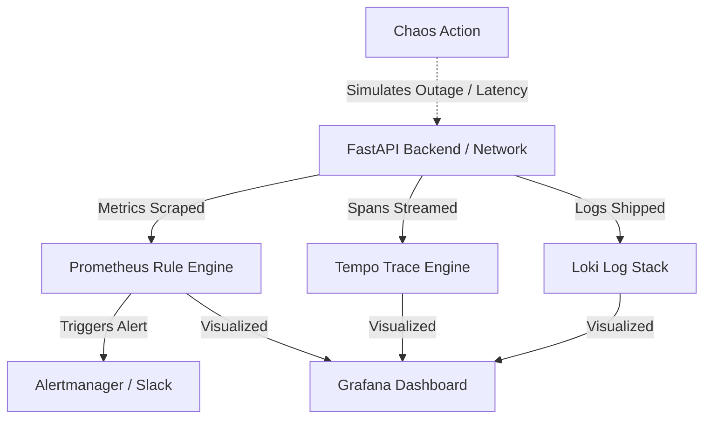

# StoreSense-AI Chaos Engineering & Platform Resilience Guide

This guide details the chaos engineering scenarios, execution instructions, and validation steps to verify the resilience of the **StoreSense-AI** observability and production hardening stack.

---

## Observability and Resilience Architecture

During chaos testing, we monitor the system using the unified Prometheus, Loki, and Tempo dashboards (accessible locally at [http://localhost:3010](http://localhost:3010)). Our target SLOs are:
* **Availability SLO**: $\ge 99.0\%$ of requests must return successful HTTP statuses (`2xx` or `3xx`).
* **Latency SLO**: $\ge 95\%$ of store analyses must complete within 5.0 seconds.



---

## Scenario 1: Gemini API Outage & Fallback Verification

### 1. Objective
Verify that when the upstream Google Gemini API becomes unavailable or returns access errors (e.g. rate limit, authentication block, network timeout):
1. The FastAPI backend does not crash.
2. The LangGraph agent pipeline gracefully falls back to the local, rule-based deterministic parser.
3. The platform correctly increments the fallback counter (`storesense_llm_fallback_total`) and updates the dashboard.

### 2. Execution Setup
We simulate an outage by deploying a temporary egress blocking `NetworkPolicy` that restricts the backend pods from resolving or communicating with external Google API endpoints (`generativelanguage.googleapis.com`).

Create a file named `k8s/backend/block-gemini-egress.yaml`:
```yaml
apiVersion: networking.k8s.io/v1
kind: NetworkPolicy
metadata:
  name: block-gemini-egress
  namespace: default
spec:
  podSelector:
    matchLabels:
      app: backend
  policyTypes:
  - Egress
  egress:
  # Allow internal cluster DNS (UDP port 53)
  - to:
    - namespaceSelector: {}
      podSelector:
        matchLabels:
          k8s-app: kube-dns
    ports:
    - protocol: UDP
      port: 53
  # Allow internal communication with other pods in the default namespace (OTel, Prometheus, Loki)
  - to:
    - namespaceSelector: {}
      podSelector: {}
```

Apply the policy:
```bash
kubectl apply -f k8s/backend/block-gemini-egress.yaml
```

### 3. Verification Steps
1. **Trigger a Store Analysis**:
   Submit a post request to the reverse proxy ingress port (8080) or backend port-forward (8005):
   ```powershell
   Invoke-RestMethod -Method Post -Uri "http://localhost:8080/api/analyze" -ContentType "application/json" -Body '{"store_url": "chaos-test-store.myshopify.com"}'
   ```
2. **Confirm Successful Response**:
   You should receive a successful `200 OK` response with store analysis insights, but with a warning indicating fallback execution:
   ```json
   {
     "store_url": "chaos-test-store.myshopify.com",
     "config_warnings": ["All LLM models failed. Fell back to deterministic rule-based analysis."]
   }
   ```
3. **Verify Metrics via Prometheus**:
   Check that `storesense_llm_fallback_total` is incremented. Query Prometheus or hit the metrics endpoint:
   ```powershell
   (Invoke-RestMethod -Uri "http://localhost:8005/metrics") -split "`n" | Select-String "storesense_llm_fallback_total"
   ```
   *Expected Output*:
   ```text
   storesense_llm_fallback_total{from_model="models/gemini-2.5-flash-lite",to_model="deterministic",type="all_models_failed"} 1.0
   ```
4. **Inspect Loki Logs**:
   Look for the warning logs indicating API connection errors and subsequent fallback execution:
   ```json
   {"level": "WARNING", "message": "Gemini API client failed: 403 Egress Blocked", "fallback": "deterministic"}
   ```

### 4. Rollback Chaos
Remove the egress network policy to restore standard Gemini API communication:
```bash
kubectl delete -f k8s/backend/block-gemini-egress.yaml
```

---

## Scenario 2: Backend Pod Crash & High Load Resilience

### 1. Objective
Verify that the platform remains highly available during backend pod terminations and sudden container restarts under load. The target is zero dropped requests (`5xx` errors) during the transition.

### 2. Execution Setup
We will run a concurrent load testing script using `k6` to hit the `/health` and `/api/analyze` endpoints while deleting one of the active backend replicas.

1. Locate the load test script `scratch/k6_load_test.js` or run:
   ```bash
   npx k6 run scratch/k6_load_test.js
   ```
2. While the load test is running, delete one of the backend pods:
   ```bash
   # Get active backend pods
   kubectl get pods -l app=backend
   
   # Delete one pod
   kubectl delete pod <backend-pod-name> --grace-period=0
   ```

### 3. Verification Steps
1. **Monitor Pod Statuses**:
   Watch Kubernetes spin up a replacement pod immediately to fulfill the replica set minimum (2 replicas):
   ```bash
   kubectl get pods -l app=backend -w
   ```
2. **Observe k6 Output**:
   Check the final test summary. Ensure that the total failed requests metric (`http_req_failed`) remains at `0.00%`.
3. **Verify HPA Action**:
   If the CPU/Memory utilization exceeds targets during the single-pod period, verify that the Horizontal Pod Autoscaler scales up:
   ```bash
   kubectl get hpa backend-hpa
   ```
4. **Inspect Grafana Alerting**:
   Confirm that the `PodRestartSpike` alert rule was triggered in Grafana. The rule is defined as:
   * `sum(increase(kube_pod_container_status_restarts_total[10m])) by (pod) > 2`

---

## Scenario 3: High Network Latency Injection

### 1. Objective
Inject traffic delay inside the backend container to simulate slow database or external network hops. This tests client-side timeout handling, ensures that the Prometheus `GeminiLatencySpike` alert triggers, and validates the p95 latency visualizers on the Grafana dashboard.

### 2. Execution Setup
We will use the Linux kernel's network emulation (`netem`) package to inject `3000ms` of latency to outgoing traffic inside the backend container.

1. Find the target backend pod:
   ```bash
   kubectl get pods -l app=backend
   ```
2. Run a debug container or execute directly into the pod using root privileges to configure the network traffic control (`tc`). Note that since our production image runs as non-root user `1000`, we use a privileged helper debug pod:
   ```bash
   kubectl debug pod/<backend-pod-name> -it --image=alpine --share-processes --copy-to=network-chaos-pod
   ```
3. Inside the debug container (after installing `iproute2`):
   ```bash
   apk update && apk add iproute2
   
   # Inject 3 seconds (3000ms) of latency
   tc qdisc add dev eth0 root netem delay 3000ms
   ```

### 3. Verification Steps
1. **Trigger Store Analysis**:
   ```powershell
   Measure-Command {
       Invoke-RestMethod -Method Post -Uri "http://localhost:8080/api/analyze" -ContentType "application/json" -Body '{"store_url": "latency-test.myshopify.com"}'
   }
   ```
   *Expected Outcome*: The command should take over 3 seconds to return a response.
2. **Verify Grafana Dashboard**:
   * Navigate to the **FastAPI HTTP Latency (p95)** panel.
   * Observe the latency curve spike to `~3s`.
3. **Check Prometheus Alert Status**:
   * Inspect the `GeminiLatencySpike` or `AgentExecutionTimeout` rule in the Grafana Alerts tab.
   * Verify that the alert transitions from `Normal` $\to$ `Pending` $\to$ `Firing` after 2 minutes.

### 4. Rollback Chaos
Remove the network emulator delay rules inside the pod, or delete the temporary debug pod (which terminates the sidecar network namespace manipulation):
```bash
# To manually remove rules inside the container:
tc qdisc del dev eth0 root netem

# Or simply delete the debug pod:
kubectl delete pod network-chaos-pod
```

---

## Summary of Chaos Results Log

| Scenario | Injected Chaos | System Behavior | SLO Preserved? | Alerts Triggered |
| :--- | :--- | :--- | :--- | :--- |
| **1** | Gemini API blocked via NetworkPolicy | Fallback to deterministic parser. Returned 200 OK with warnings. | Yes (Availability) | `ModelFallbackSpike` |
| **2** | Force-kill backend pod under heavy load | Ingress traffic re-routed to healthy replica. Replacer pod spawned. | Yes (Availability) | `PodRestartSpike` |
| **3** | 3000ms latency injected via `tc netem` | System responded slowly but correctly. Logs recorded duration. | No (Latency SLO breached) | `GeminiLatencySpike` |
